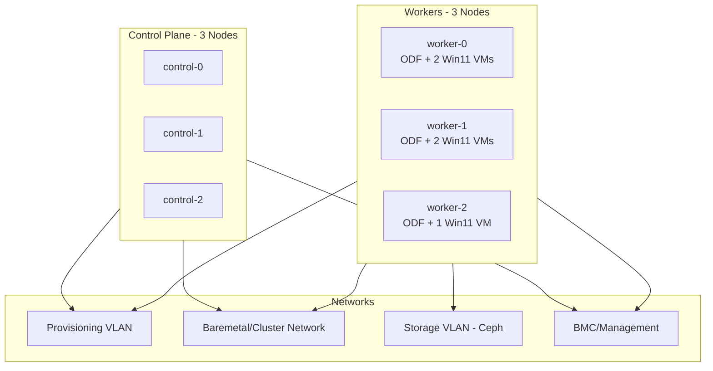

# Hardware Requirements: 6-Node Bare Metal OpenShift 4.21 Cluster

This document itemizes the bare metal hardware and networking required to deploy
a 6-node OpenShift Container Platform 4.21 cluster with OpenShift Data Foundation
(Ceph internal mode) and OpenShift Virtualization running 5 concurrent Windows 11
virtual machines.

---

## Cluster Topology

| Role | Count | Workloads |
|------|-------|-----------|
| Control Plane | 3 | API server, etcd, scheduler, controllers |
| Worker | 3 | ODF/Ceph, OpenShift Virtualization, Windows 11 VMs |

---

## Control Plane Nodes (x3)

Sized for API server, etcd, scheduler, and controller workloads only. No user
workloads are scheduled on control plane nodes.

| Component | Minimum | Recommended |
|-----------|---------|-------------|
| CPU | 1x 8-core Intel Xeon / AMD EPYC (16 threads w/ SMT) | 1x 16-core (32 threads) |
| RAM | 32 GB DDR4/DDR5 ECC | 64 GB DDR4/DDR5 ECC |
| OS Disk | 1x 240 GB NVMe SSD | 1x 480 GB NVMe SSD |
| NICs | 2x 10 GbE | 2x 25 GbE |
| BMC | IPMI 2.0 or Redfish | Redfish |

> **etcd latency requirement:** The OS disk on control plane nodes **must** be
> NVMe or SSD capable of &le;10 ms p99 fsync latency. Spinning disks are not
> acceptable. etcd is extremely sensitive to disk I/O; failing this requirement
> causes cluster instability.

---

## Worker Nodes (x3)

Each worker runs ODF (Ceph OSD + MON + MDS daemons), OpenShift Virtualization
components, and 1-2 Windows 11 virtual machines.

### Resource Budget Per Worker

| Layer | CPU (logical) | RAM |
|-------|--------------|-----|
| ODF (Ceph daemons) | 10 | 24 GiB |
| Windows 11 VMs (2 per node, worst case) | 8 | 16 GiB + ~1 GiB KubeVirt overhead |
| OCP base (kubelet, CRI-O, SDN, monitoring) + Virt operator | 4 | 8 GiB |
| **Subtotal** | **~22 logical CPUs** | **~50 GiB** |

### Hardware Specification

| Component | Minimum | Recommended |
|-----------|---------|-------------|
| CPU | 1x 16-core (32 threads w/ SMT) | 1x 24-core (48 threads) |
| RAM | 64 GB DDR4/DDR5 ECC | 96 GB DDR4/DDR5 ECC |
| OS Disk | 1x 480 GB SSD | 1x 480 GB NVMe SSD |
| ODF Storage | 2x 1 TB NVMe SSD | 2x 2 TB NVMe SSD |
| NICs | 2x 10 GbE | 3x 25 GbE (cluster + storage + provisioning) |
| BMC | IPMI 2.0 or Redfish | Redfish |

### Required CPU Features

All worker CPUs **must** support:

- **Intel VT-x** or **AMD-V** &mdash; hardware virtualization extensions
- **Intel VT-d** or **AMD-Vi** &mdash; IOMMU for device passthrough
- **NX bit** (No eXecute) &mdash; required by RHCOS and KubeVirt
- **x86-64-v2 ISA** &mdash; minimum instruction set for RHCOS (OCP 4.13+)

These features must be enabled in the BIOS/UEFI firmware before installation.

---

## ODF / Ceph Storage

### Deployment Overview

| Parameter | Value |
|-----------|-------|
| Deployment Mode | Internal (Ceph runs on the 3 worker nodes) |
| Replication Factor | 3x (data copied across all 3 failure domains) |
| Backing Devices | Local NVMe/SSD via Local Storage Operator |
| Min Device Size (production) | 0.5 TiB per device |

### Capacity Planning

| Configuration | Devices Per Worker | Raw Total | Usable Capacity |
|---------------|-------------------|-----------|-----------------|
| Minimum | 2x 1 TB NVMe | 6 TB | ~2 TB |
| Recommended | 2x 2 TB NVMe | 12 TB | ~4 TB |

> Usable = Raw &divide; 3 (replication factor). Ceph raises alerts at 75%
> (near-full) and 85% (full) of raw capacity. Plan to keep utilization below
> 75%.

### Storage Consumption Estimate

| Consumer | Capacity |
|----------|----------|
| Windows 11 VM disks (5x 100 GB) | 500 GB usable |
| VM persistent vTPM state PVCs | ~50 MB (negligible) |
| Remaining for other PVCs | ~1.5 TB (minimum) / ~3.5 TB (recommended) |

### Storage Classes Provided by ODF

| Storage Class | Ceph Backend | Access Modes | Use Case |
|---------------|-------------|--------------|----------|
| ocs-storagecluster-ceph-rbd | RBD (block) | RWO | VM boot disks, databases |
| ocs-storagecluster-cephfs | CephFS (filesystem) | RWX | Shared storage, live migration state |

---

## Windows 11 Virtual Machine Requirements

### Per-VM Specification

| Resource | Value |
|----------|-------|
| vCPU | 4 |
| RAM | 8 GB |
| Boot Disk | 100 GB (RBD block PV from ODF) |
| Firmware | UEFI (required by Windows 11) |
| Secure Boot | Enabled |
| vTPM | 2.0, persistent (backed by RWX PVC via CephFS) |

### Aggregate Resources (5 VMs)

| Resource | Total |
|----------|-------|
| vCPU | 20 |
| RAM | 40 GB |
| Disk | 500 GB |

### OpenShift Virtualization Requirements

- OpenShift Virtualization operator installed via OperatorHub
- `HyperConverged` CR configured with `vmStateStorageClass` pointing to the
  CephFS storage class for persistent vTPM state
- Live migration requires ReadWriteMany (RWX) storage, satisfied by ODF CephFS
- KubeVirt memory overhead per VM: approximately
  `(1.002 x requested_memory) + 146 MiB + (8 MiB x vCPUs)`

---

## Networking Requirements

### Network Topology

Four logical networks are required. These can be separate physical networks or
VLANs on a shared fabric.

| # | Network | Scope | Purpose | Speed |
|---|---------|-------|---------|-------|
| 1 | Baremetal / Cluster | All 6 nodes | API, Ingress, pod-to-pod, cluster traffic | 10 GbE min, 25 GbE recommended |
| 2 | Provisioning | All 6 nodes | PXE boot during IPI install (managed by Ironic) | 1 GbE sufficient |
| 3 | Storage | 3 workers only | Ceph OSD replication traffic | 25 GbE strongly recommended |
| 4 | BMC / Management | All 6 nodes (BMC ports) | Out-of-band IPMI/Redfish management | 1 GbE |

> The provisioning network can be omitted if deploying with Redfish virtual
> media (`redfish-virtualmedia` or `idrac-virtualmedia` BMC driver). In that
> case, all nodes boot via virtual media over the BMC network and only 3
> logical networks are needed.

### DNS Records

The following DNS records must exist before installation begins:

| Record | Type | Target |
|--------|------|--------|
| `api.<cluster_name>.<base_domain>` | A | API VIP |
| `api-int.<cluster_name>.<base_domain>` | A | API VIP |
| `*.apps.<cluster_name>.<base_domain>` | A (wildcard) | Ingress VIP |
| `<node-hostname>.<cluster_name>.<base_domain>` (x6) | A | Node IP |
| Reverse PTR for each node IP | PTR | Node FQDN |

### DHCP

- **Provisioning network:** DHCP is managed automatically by Ironic during IPI
  install; do not run an external DHCP server on this network.
- **Baremetal network:** Requires either a DHCP server providing IPs to all
  nodes or static IP assignment in the `install-config.yaml`.

### Firewall / Port Requirements

| Service | Protocol | Ports | Between |
|---------|----------|-------|---------|
| Kubernetes API | TCP | 6443 | Clients &rarr; API VIP |
| Machine Config Server | TCP | 22623 | Nodes &rarr; API VIP |
| Ingress HTTP | TCP | 80 | Clients &rarr; Ingress VIP |
| Ingress HTTPS | TCP | 443 | Clients &rarr; Ingress VIP |
| etcd | TCP | 2379-2380 | Control plane &harr; control plane |
| Ceph MON | TCP | 3300, 6789 | Workers &harr; workers (storage network) |
| Ceph OSD | TCP | 6800-7300 | Workers &harr; workers (storage network) |
| VXLAN / Geneve (OVN) | UDP | 4789, 6081 | All nodes &harr; all nodes |
| Node-to-node (kubelet) | TCP | 10250 | All nodes &harr; all nodes |
| NodePort range | TCP/UDP | 30000-32767 | Clients &rarr; workers |

### Switch Requirements

- Managed switch supporting 802.1Q VLANs
- LLDP support (used by baremetal operator for network discovery)
- Jumbo frames (MTU 9000) recommended on the storage VLAN to reduce CPU
  overhead and improve Ceph throughput
- Redundant switches (pair or stacked) recommended for production

---

## Hardware Totals Summary

| Resource | Control Plane (3 nodes) | Workers (3 nodes) | Cluster Total |
|----------|------------------------|--------------------|---------------|
| Physical Cores (min) | 3 x 8 = 24 | 3 x 16 = 48 | **72** |
| Physical Cores (rec) | 3 x 16 = 48 | 3 x 24 = 72 | **120** |
| RAM (min) | 3 x 32 GB = 96 GB | 3 x 64 GB = 192 GB | **288 GB** |
| RAM (rec) | 3 x 64 GB = 192 GB | 3 x 96 GB = 288 GB | **480 GB** |
| OS Disks | 3 x 240 GB NVMe | 3 x 480 GB SSD | **6 disks** |
| ODF Storage Disks | -- | 3 x (2 x 1 TB NVMe) | **6 disks, 6 TB raw** |
| Total Disks | 3 | 9 | **12** |
| NICs (min) | 3 x 2 = 6 | 3 x 2 = 6 | **12** |
| NICs (rec) | 3 x 2 = 6 | 3 x 3 = 9 | **15** |

---

## Estimated Cost (USD)

> **Disclaimer:** Prices below are approximate mid-2025 US street prices from
> public reseller listings (CDW, Newegg, Dell, HPE). Actual costs vary
> significantly by vendor, volume discounts, contract pricing, and
> region. OEM-bundled servers (e.g. Dell PowerEdge, HPE ProLiant) may be
> more or less expensive than the component-level estimates shown here.
> Red Hat subscription costs are listed separately and are not included
> in the hardware totals.

### Control Plane Node &mdash; Bill of Materials (per node)

| Component | Spec (Recommended) | Est. Unit Price | Qty | Subtotal |
|-----------|--------------------|----------------:|----:|---------:|
| CPU | Intel Xeon Silver 4416+ (16C/32T) or AMD EPYC 8324P | $1,100 | 1 | $1,100 |
| RAM | 32 GB DDR5-5600 ECC RDIMM | $275 | 2 | $550 |
| OS Disk | 480 GB Enterprise NVMe SSD (Micron 7450 PRO or equiv.) | $175 | 1 | $175 |
| NIC | Intel E810-XXVDA2 dual-port 25 GbE SFP28 | $450 | 1 | $450 |
| Chassis | 1U rack server (motherboard, dual PSU, BMC, fans, rails) | $2,500 | 1 | $2,500 |
| **Per-node total** | | | | **$4,775** |

### Worker Node &mdash; Bill of Materials (per node)

| Component | Spec (Recommended) | Est. Unit Price | Qty | Subtotal |
|-----------|--------------------|----------------:|----:|---------:|
| CPU | Intel Xeon Gold 5418Y (24C/48T) or AMD EPYC 8434P | $1,500 | 1 | $1,500 |
| RAM | 32 GB DDR5-5600 ECC RDIMM | $275 | 3 | $825 |
| OS Disk | 480 GB Enterprise NVMe SSD (Micron 7450 PRO or equiv.) | $175 | 1 | $175 |
| ODF Storage | 2 TB Enterprise NVMe U.2 SSD (Samsung PM9A3 or equiv.) | $550 | 2 | $1,100 |
| NIC (cluster + prov.) | Intel E810-XXVDA2 dual-port 25 GbE SFP28 | $450 | 1 | $450 |
| NIC (storage) | Intel E810-XXVDA1 single-port 25 GbE SFP28 | $250 | 1 | $250 |
| Chassis | 2U rack server (motherboard, dual PSU, BMC, fans, rails) | $2,800 | 1 | $2,800 |
| **Per-node total** | | | | **$7,100** |

### Networking Infrastructure

| Component | Spec | Est. Unit Price | Qty | Subtotal |
|-----------|------|----------------:|----:|---------:|
| ToR Switch | 24-port 25 GbE SFP28 + 4x 100 GbE uplink, managed L3 (e.g. Dell S5224F-ON) | $12,000 | 1 | $12,000 |
| SFP28 DAC Cables | 25 GbE SFP28 direct-attach copper, 2m | $25 | 15 | $375 |

### Cluster Cost Summary

| Line Item | Calculation | Est. Cost |
|-----------|-------------|----------:|
| Control Plane Nodes | 3 x $4,775 | **$14,325** |
| Worker Nodes | 3 x $7,100 | **$21,300** |
| Network Switch | 1 x $12,000 | **$12,000** |
| SFP28 Cables | 15 x $25 | **$375** |
| **Hardware Total** | | **$48,000** |

### Red Hat Subscriptions (annual, not included above)

| Subscription | Scope | Est. Annual Cost |
|--------------|-------|------------------:|
| OpenShift Container Platform (Premium, per 2-core pair) | 60 pairs (120 cores recommended) | ~$30,000 &ndash; $60,000 |
| OpenShift Data Foundation (per 2-core pair, workers only) | 36 pairs (72 cores recommended) | ~$18,000 &ndash; $36,000 |
| Windows 11 Pro licenses | 5 VMs | ~$1,000 |

> Subscription costs depend heavily on the Red Hat agreement type
> (standard vs. premium, self-support vs. full), term length, and
> whether an existing Enterprise Agreement covers the nodes. Contact
> your Red Hat account team or partner for an actual quote. Windows
> licenses may be covered by existing Microsoft agreements (SA, CSP, etc.).

---

## Supporting Infrastructure

The following ancillary services are required outside the cluster itself:

| Service | Notes |
|---------|-------|
| Load Balancer | HAProxy, F5, or similar for API VIP (TCP 6443, 22623) and Ingress VIP (TCP 80, 443). MetalLB can be used post-install as an alternative. |
| DNS Server | Authoritative for cluster zone with forward (A) and reverse (PTR) records for all nodes, API VIP, and Ingress wildcard. |
| DHCP Server | For the baremetal network (or use static IPs). Not needed on the provisioning network (Ironic manages its own DHCP). |
| NTP Source | All nodes must synchronize time. Chrony is configured via MachineConfig. |
| Network Switch | Managed switch (or redundant pair) supporting VLANs, LLDP, and jumbo frames. |
| Image Registry | Internet access to `quay.io` and `registry.redhat.io`, or a disconnected mirror registry if air-gapped. |

---

## References

- [OCP 4.17 Bare Metal Install Prerequisites](https://docs.openshift.com/container-platform/4.17/installing/installing_bare_metal/installing-bare-metal.html)
- [ODF 4.17 Infrastructure Requirements](https://docs.redhat.com/en/documentation/red_hat_openshift_data_foundation/4.17/html/planning_your_deployment/infrastructure-requirements_rhodf)
- [OpenShift Virtualization Installation Requirements](https://docs.redhat.com/en/documentation/openshift_container_platform/4.19/html/installing_on_bare_metal/preparing-to-install-on-bare-metal)
- [Windows 11 System Requirements (Microsoft)](https://docs.microsoft.com/en-us/windows/whats-new/windows-11-requirements)
- [Running Windows 11 VMs in OpenShift with Persistent vTPM](https://redhat.com/en/blog/running-windows-11-and-2022-server-virtual-machines-red-hat-openshift-persistent-vtpm)
- [ODF Sizing Tool](https://access.redhat.com/labs/ocsst/)
